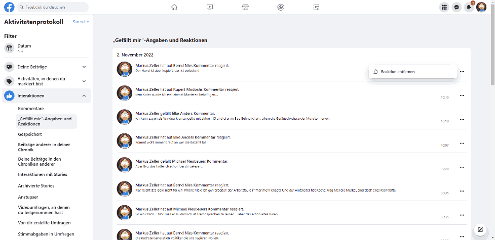
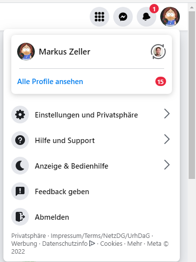
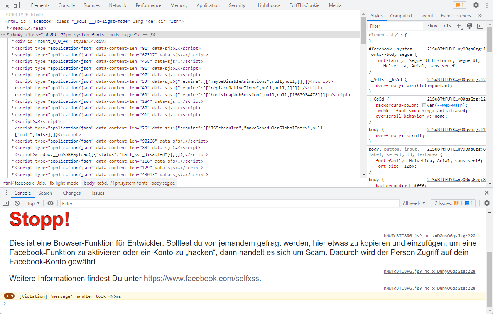

# Delete facebook interactions

Nun ist es wohl strafbar, wenn man strafbare Facebook-Posts oder ähnliches liked.
Da Facebook selbst keine Möglichkeit bietet, die Likes zu löschen, habe ich mir ein kleines Script geschrieben, welches die Likes löscht.

## Showcase

## Hinweise

Das Script funktioniert nur, wenn dein Browser bzw. die Facebook-Seite auf Deutsch eingestellt ist. Bei einer anderen Sprache mußt du den Selektor `"Weitere Optionen"` entsprechend anpassen.

## Anleitung

1. Gehe auf dein Facebook Profil

2. Einstellungen und Privatsphäre
3. Aktivitätenprotokoll
4. Interaktionen
5. „Gefällt mir“-Angaben und Reaktionen
6. Drücke F12 auf der Tastatur

7. Kopiere den Inhalt von [src/deleteLikes.js](src/deleteLikes.js) unten in die Konsole wo der Cursor blinkt und drücke `Enter`.

# Fertig!
